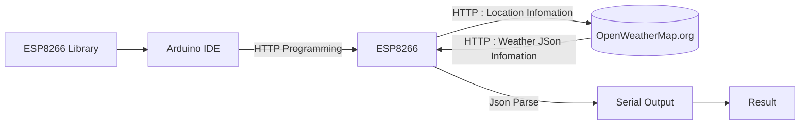

문서정보 : 2022.08.13. 작성, 작성자 [@SAgiKPJH](https://github.com/SAgiKPJH)

# 목차
0. 구현 과정
1. Arduino IDE
2. Arduino IDE - ESP8266 Library
3. ESP8266 장비
4. 기본 실습 ESP8266 기본 프로그래밍
5. HTTP
6. ESP8266 HTTP
7. Json
9. ESP8266 - Get Weather Station

 

# **0. 구현 과정**

# **1. ESP8266 환경 설정**

### ◆ ESP8266 하드웨어 연결
- 준비물
  - ESP8266
  - USB to Serial 변환 장치
 
 

### ◆ ESP8266 소프트웨어 환경 준비
 - 내용
 
 

# **2. ESP8266 환경 설정**

### ◆ 소제목
- 내용

 
 

# 참조
- ESP8266 Weather Station 영상
  - https://mcuoneclipse.com/2017/09/09/wifi-oled-mini-weather-station-with-esp8266/
  - https://www.youtube.com/watch?v=McwarmDpQXo
  - https://www.youtube.com/watch?v=7uV1J4KVtQs
- ESP8266 라이브러리 설치(설정)
  - https://randomnerdtutorials.com/how-to-install-esp8266-board-arduino-ide/
- ESP8266 HTTP, WeatherStation Guide
  - https://randomnerdtutorials.com/esp8266-nodemcu-http-get-open-weather-map-thingspeak-arduino/
